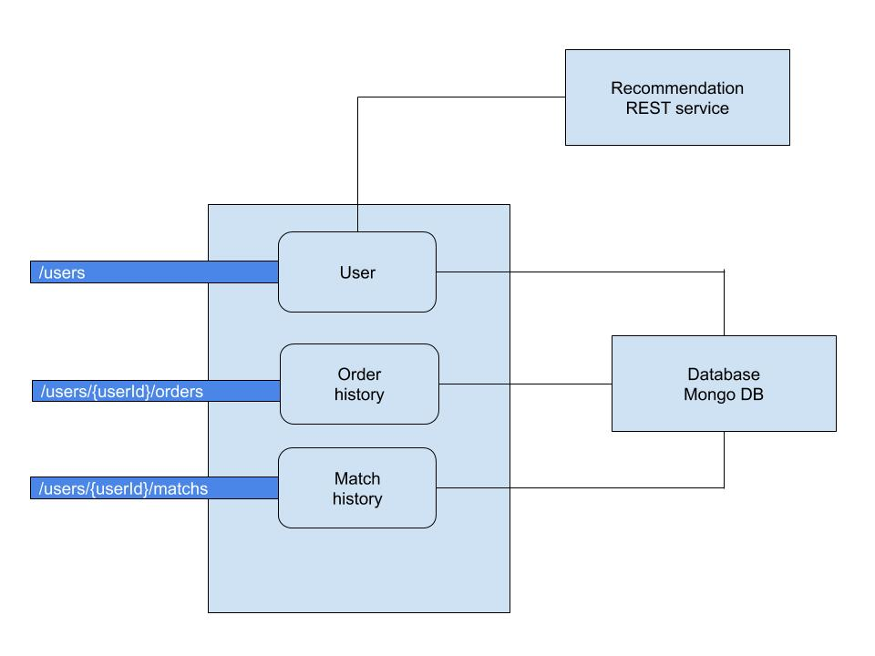

# @loopback/Match API

This project aims to represent an online match platform APIs!



## Overview

This tutorial demonstrates how to create a basic API for a Match using
LoopBack 4. You will experience how you can create REST APIs with just


## Setup

First, you'll need to install a supported version of Node:

- [Node.js](https://nodejs.org/en/) at v10 or greater

Additionally, this tutorial assumes that you are comfortable with certain
technologies, languages and concepts.

- JavaScript (ES6)
- [REST](http://www.restapitutorial.com/lessons/whatisrest.html)

Lastly, you'll need to install the LoopBack 4 CLI toolkit:

```sh
npm i -g @loopback/cli
```

## Installation

Do the following to clone and start the project.

In case you have Docker installed on your system and don't want to manually
install MongoDB and Redis, you can run `npm run docker:start` to download their
images and start the servers. Otherwise, you can skip this command.

```sh
$ git clone https://github.com/abraham-tech/match-api.git
$ cd match-api
$ npm i
$ npm start
```


## Models

This app has the following models:

1. `User` - representing the users of the system.
2. `UserCredentials` - representing sensitive credentials like a password.
3. `Service` - a model which handle each service requests.
4. `Feedback` - a model to represent service response.


`User` is also marked as having one `UserCredentials` model using the `@hasOne`
decorator. The `belongsTo` relation for `UserCredentials` to `User` has not been
created to keep the scope smaller.

## Controllers

Controllers expose API endpoints for interacting with the models and more.

In this app, there are four controllers:

1. `ping` - a simple controller to checking the status of the app.
2. `user-management` - controller for creating user, fetching user info,
   updating user info, and logging in.
3. `Feedback-controller`
4. `Service-controller`


## Services

Services are modular components that can be plugged into a LoopBack application
in various locations to contribute additional capabilities and features to the
application.

This app has five services:

1. `services/recommender.service` - responsible for connecting to a "remote"
   server and getting recommendations for a user. The API endpoint at
   `GET /users​/{userId}​/recommend`, is made possible by this service.
2. `services/user-management.service` - responsible for verifying if user exists
   and the submitted password matches that of the existing user.
3. `services/hash.password.bcryptjs` - responsible for generating and comparing
   password hashes.
4. `services/validator` - responsible for validating email and password when a
   new user is created.
5. `services/jwt.service` - responsible for generating and verifying JSON Web
   Token.


### Login

The endpoint for logging in a user is a `POST` request to `/users/login`.

Once the credentials are extracted, the logging-in implementation at the
controller level is just a four step process. This level of simplicity is made
possible by the use of the `UserService` service provided by
`@loopback/authentication`.

1. `const user = await this.userService.verifyCredentials(credentials)` - verify
   the credentials.
2. `const userProfile = this.userService.convertToUserProfile(user)` - generate
   user profile object.
3. `const token = await this.jwtService.generateToken(userProfile)` - generate
   JWT based on the user profile object.
4. `return {token}` - send the JWT.

You can see the details in
[`packages/shopping/src/controllers/user-management.controller.ts`](https://github.com/strongloop/loopback4-example-shopping/blob/master/packages/shopping/src/controllers/user.controller.ts).

### Authorization

Endpoint authorization is done using
[@loopback/authorization](https://github.com/strongloop/loopback-next/tree/master/packages/authorization).
Use the `@authorize` decorator to protect access to controller methods.

All controller methods without the `@authorize` decorator will be accessible to
everyone. To restrict access, specify the roles in the `allowedRoles` property.
Here are two examples to illustrate the point.

Unprotected controller method (no `@authorize` decorator), everyone can access
it:

```ts
async find(
  @param.query.object('filter', getFilterSchemaFor(Product))
  filter?: Filter<Product>,
): Promise<Product[]> {
  ...
}
```

Protected controller method, only `admin` and `customer` can access it:

```ts
@authorize({
  allowedRoles: ['admin', 'customer'],
  voters: [basicAuthorization],
})
async set(
  @inject(SecurityBindings.USER)
  currentUserProfile: UserProfile,
  @param.path.string('userId') userId: string,
  @requestBody({description: 'update user'}) user: User,
): Promise<void> {
  ...
}
```

There are three roles in this app: `admin`, `supporter`, and `customer`. You can
go through the controller methods in
[user-controller.ts](/packages/shopping/src/controllers/user-management.controller.ts)
and
[shopping-cart.controller.ts](/master/packages/shopping/src/controllers/shopping-cart.controller.ts)
to see which roles are given access to which methods.

The authorization implementation is done via voter functions. In this app, there
is just a single voter function - 'basicAuthorization'. It implements the
following rules:

1. No access if the user was created without a `roles` property.
2. No access if the user's role in not in the `allowedRoles` authorization
   metadata.
3. User can access only model's belonging to themselves.
4. `admin` and `support` roles bypass model ownership check.

For more details about authorization in LoopBack 4, refer to
https://loopback.io/doc/en/lb4/Loopback-component-authorization.html.


## Tests

Run `npm test` from the root folder.

## Contributors

See
[all contributors](https://github.com/strongloop/loopback-next/graphs/contributors).

## License

MIT
